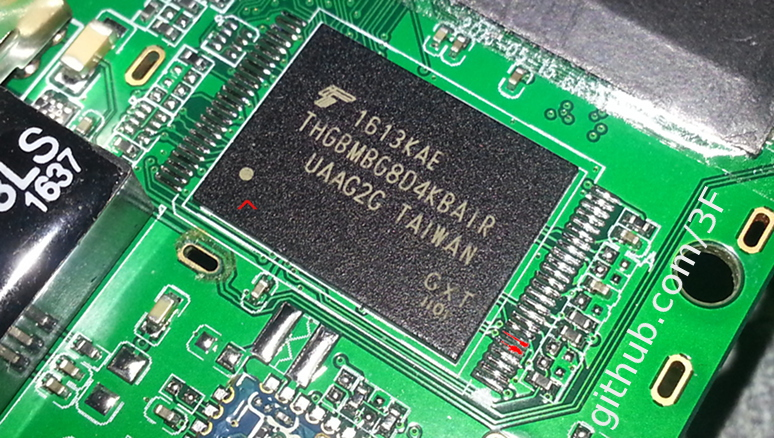

```
Copyright (c) 2018  Denis Kuzmin <x-3F@outlook.com> github/3F
```

[ [ ☕ ](https://3F.github.io/Donation/) ]

My personal experiments since ~February 2018 thanks to my personal reverse engineering because the manufacturer of the board refused to provide the source code even though it is under GPL.

*Nobody has been hurt except my time.*

⚠ Everything below is at your own risk. Enjoy.

```
~ DDR init; h224_v2.01_M9S-PRO ~
00009800  03 02 01 00 00 03 02 00 00 0C 10 02 00 00 00 00  ................
00009810  00 00 00 01 00 00 00 00 00 00 00 00 00 00 00 00  ................
00009820  00 00 00 00 00 00 00 00 00 00 00 00 00 00 00 00  ................
00009830  00 00 00 00 00 00 00 00 00 00 00 00 00 00 00 00  ................
00009840  00 00 00 00 06 50 00 0A 78 00 E8 03 00 00 00 00  .....P..x.и.....
00009850  20 4E 80 08 E8 03 B4 00 00 00 00 00 00 00 00 00   NЂ.и.ґ.........
00009860  00 00 21 00                                      ..!.
```

# AML Gxb

s905 ARM64; For h224_v2.01_M9S-PRO (RAM & ROM: 3G `kmr21000bm-b809` & 32G `thgbmbg8d4kbair`)

DRAM bus width for s905 is **16-bit**:

* 16 lines, balls {P4, P1, R1, V1, L4, U2, N2, T2, M2, R2, L2, N3, P2, T1, N4, M1}


## Extracting bootloader from ROM

s905 bootloader will be stored with **0-offset in emmc** (s905x +512 bytes).

For attached /dev/block, we can use dd:

```bash
dd if=/dev/block/bootloader of=/usb_otg/bootloader.img
```

First ~848 Kb from bootloader.img is compiled **u-boot.**

Full prepared image: [u-boot_2G__3F__-_h224_v2.01_gxb_g4fcf8d0_aarch64.img](./resources/u-boot_2G__3F__-_h224_v2.01_gxb_g4fcf8d0_aarch64.img)


## Structure to configure DDR

Extracting img:

```
mkdir out & AmlImagePack -d u-boot_2G__3F__-_h224_v2.01_gxb_g4fcf8d0_aarch64.img out

[Msg]Image package version 0x2
[Msg]Unpack item [USB         ,              DDR] to (out\DDR.USB) size:49152 bytes
[Msg]Unpack item [USB         ,            UBOOT] to (out\UBOOT.USB) size:819200 bytes
[Msg]Unpack item [PARTITION   ,       bootloader] to (out\bootloader.PARTITION) size:868352 bytes
[Msg]Unpack item [conf        ,         platform] to (out\platform.conf) size:202 bytes
[Msg]Write config file "out\image.cfg" OK!
Image unpack OK!
```

```
Platform:0x0811
DDRLoad:0xd9000000
DDRRun:0xd9000000
UbootLoad:0x200c000
UbootRun:0xd9000000
Control0=0xd9000000:0x000000b1
Control1=0xd9000000:0x00005183
Encrypt_reg:0xc8100228
bl2ParaAddr=0xd900c000  <<<<<< BL2, see ddrpara section below
```

Offset **0x9800** from the beginning of the extracted bootloader.PARTITION

```
03 02 01 00 01 03 02 00 00 04
```

Looks like:

```
      [03] [02] [01 00] [01] 03 02 00 [ 00 04 ]
       ^
  .ddr_type ^        
  .ddr_channel_set  ^
              .ddr_clk   ^
                 .ddr_size_detect          ^
                                     .ddr_size
                                     
```

* If .ddr_size_detect = **0** then, for example, .ddr_size = **00 04** will map only 1024Mb
* If .ddr_size_detect = **1**, it will use an std algorithm to detect the range.

That is, we need to reset .ddr_size_detect flag and use .ddr_size like:

```
0002: 512MB
0004: 1G
0008: 2G
...
```

An original structure and types of fields in \uboot-2015-11-04-e90bf25ce2\arch\arm\include\asm\arch-gxb\timing.h

Values: \board\amlogic\gxb_p201_v1\firmware\timing.c; \include\configs\gxb_p201_v1.h

* The **__ddr_setting** struct (where defined this fields) should be marked with a magic word **ddrs_** (`64 64 72 73 5F`)

\arch\arm\cpu\armv8\gxb\firmware\acs\acs.c
  Placed at the end - address **0x9AE0**

```
    .ddr_magic          = "ddrs_",
    .ddr_set_version    = 1,
    .ddr_set_length     = sizeof(ddr_set_t),
    .ddr_set_addr       = (unsigned long)(&__ddr_setting),    
```

Field types - \arch\arm\include\asm\arch-gxb\acs.h

```
    //ddr setting part, 16 bytes
    char                ddr_magic[5]; //magic word. 
    unsigned char       ddr_set_version; //struct version, for PC tool use.
    unsigned short      ddr_set_length; //length of ddr struct.
    unsigned long       ddr_set_addr; //address of ddr setting.
```

Finally, the specific address of block with the entire structure and its length is calculated as follows:

```
* Find "ddrs_" (64 64 72 73 5F)
* The next byte indicates the version - 03
* After, 44 01 is a size of struct: 324 bytes
* Next must be unsigned long 4 bytes, But! my value is too large or written with an offset in 0xD9000000: 

Thus, we are moving to 0x9800


00009800  03 02 01 00 00 03 02 00 00 0C 10 02 00 00 00 00  ................
00009810  00 00 00 01 00 00 00 00 00 00 00 00 00 00 00 00  ................
00009820  00 00 00 00 00 00 00 00 00 00 00 00 00 00 00 00  ................
00009830  00 00 00 00 00 00 00 00 00 00 00 00 00 00 00 00  ................
00009840  00 00 00 00 06 50 00 0A 78 00 E8 03 00 00 00 00  .....P..x.и.....
00009850  20 4E 80 08 E8 03 B4 00 00 00 00 00 00 00 00 00   NЂ.и.ґ.........
00009860  00 00 21 00                                      ..!.


^ This is full data of struct to configure DDR.  
```

## Changing DDR binary struct

We need to rehash and rebuild the header of this file before updating ROM.

However, we shouldn't use header from image.h (u-boot).

Our header is a special **executable sequence for AML** processors (**ddrpara** sequence, see below)

Fortunately, Amlogic distributes an closed linux tool **aml_encrypt_gxb** (in \fip\gxb\ )

Just command this:

```
aml_encrypt_gxb --bootsig --input bootloader.PARTITION --output u-boot_new.bin
```

After, copy new data into the same folder

```
del /Q/F bootloader.PARTITION DDR.USB UBOOT.USB
ren u-boot_new.bin bootloader.PARTITION
ren u-boot_new.bin.usb.bl2 DDR.USB
ren u-boot_new.bin.usb.tpl UBOOT.USB  
```

And pack it:

```
AmlImagePack -r out\image.cfg out mod1.img
```

Don't forget to reinitialize u-boot in RAM. Reboot, or:

```
0xd9000000   // < bl2
0x200c000    // < tpl to ddr
0xd900c000   // < write here seq to exec 0x200c000  -> 0xd9000000 
```

## ARM Trusted Firmware

Boot levels called BL1, BL2, BL3-1, BL3-2 BL3-3

First part of bootloader.PARTITION is a DDR.USB:

* About 48 Kb before sequence [**010064AA**] ~ u-boot.bin.usb.bl2 (**BL2**)

  Header is an executable sequence for AML. Before `@AMLрї`

Second part starting with `010064AA` is UBOOT.USB ~ u-boot.bin.usb.tpl

## ddrpara and executable sequence for AML

### ddr init from usb

```
write DDR.USB 0xd9000000 //download usb bl2 
write usbbl2runpara_ddrinit.bin 0xd900c000 //download bl2 para
```    

where usbbl2runpara_ddrinit.bin is **BL2** seq for DDR initialization (32 bytes):
```
AB CD 12 34 00 02 00 00 DF C0 00 00 01 00 00 00 00 00 40 00 CC C0 82 00 00 00 00 10 00 00 00 00    
```

run bl2 to ddr init:
```
run 0xd9000000
```
    
### run u-boot from usb

```
write u-boot.bin.usb.bl2 0xd9000000           // bl2  
write u-boot.bin.usb.tpl 0x200c000            // tpl to ddr  
write usbbl2runpara_runfipimg.bin 0xd900c000  // for booting tpl from 0x200c000 
```

usbbl2runpara_runfipimg.bin:
```
AB CD 12 34 00 02 00 00 E1 C0 00 00 01 00 00 00 00 00 00 00 00 C0 00 00 01 00 00 00 00 C0 00 02 00 40 0A 00 57 62 CC 85 C6 7E 5E 10 D4 F8 84 DF
```

run bl2 to boot tpl:
```
run 0xd9000000
```


## u-boot copy memory & mread tests

```
mread mem 0x7FFFFFF0 normal 0x0F
```

Results for .ddr_size_detect = 0; .ddr_size = 

```
-----------------
04 08
------

0x90000000 - 0xF0000000: 770 Mb (807 403 520 bytes)
0x40000000 - 0xC0000000: 2,00 Gb (2 149 580 800 bytes)
0x10000000 - 0xC0000000: 2,75 Gb (2 954 887 168 bytes)
 0x1000000 - 0xF0000000: 2,98 Gb (3 206 545 408 bytes)


= 3Gb (-> 2^10) + 2 097 152b 
mread mem 0x1000000 normal 0xF0000000
```

**u-boot, cp - copy memory:**

```
tplcmd "cp 0x7FFFFF00 0xB0000000 0xFF"
AmlUsbTplCmd = cp 0x7FFFFF00 0xB0000000 0xFF rettemp = 1 buffer = cp 0x7FFFFF00 0xB0000000 0xFF
AmlUsbReadStatus retusb = 1
reply success
```

With the following unicorns:

* Speed. Drops down when addressing more than ~1,4G. Means not so fast as before.

As I see, **s905 has address bus width - 16-bit** (i.e. 16 lines, see balls above). That is, there should be multiplexing on addressing the second half of the upper range, anyway at least 64K+. So ...


Results for .ddr_size_detect = 0; .ddr_size = 

```
-------------
00 0C
------

limit: mread BFFFFF00 200000
that is: C01FFF00 = 3 223 322 368 b
```

and it also can be addressed like:

```
mread C0200FFE FF

or even
mread D0000000 FF
```

That is, either e-mmc or scattered pieces of reserved regions. Because the sequential reading had 3G for s905 (yes, exactly not for s905x) with magic sequence (non-repeated, and from a single region).

hmm, emmc? or...

## mtool via mread, tplcmd, bulkcmd

update.exe provides the following commands: mread, tplcmd, bulkcmd. That just sends commands to **mtool** (part of u-boot)

For example, Response of **tplcmd** command  \uboot-2015-11-04-e90bf25ce2\drivers\usb\gadget\v2_burning\v2_usb_tool\optimus_transform.c

```cpp
int optimus_working (const char *cmd, char* buff)
    ...
    else
    {
            int flag = 0;
            ret = run_command(cmd, flag);
            DWN_MSG("ret = %d\n", ret);
            /*ret = ret < 0 ? ret : 0;*/
    }

    if (ret)
    {
            memcpy(buff, "failed:", strlen("failed:"));//use memcpy but not strcpy to not overwrite storage/key info
    }
    else
    {
            memcpy(buff, "success", strlen("success"));//use memcpy but not strcpy to not overwrite storage/key info
    }
```

The only possible response "success" or "failed:". Via USB-sniffer tools, update.exe tplcmd "" will receive "failed:no command at all"

```cpp
if ((argc = cli_simple_parse_line(cmdBuf, argv)) == 0)
{
        strcpy(buff, "failed:no command at all");
        printf("no command at all\n");
        return -1; /* no command at all */
}
```

### UART


from square pin: GND, TX, RX, VCC (is not required)


## linux kernel

Unable to handle kernel paging request at virtual address 21b839b029 ? yeah :)
```
[  126.734416@0] Unable to handle kernel paging request at virtual address 21b839b029
[  126.735081@2] Unable to handle kernel paging request at virtual address 21b83b3029
[  126.735090@2] pgd = ffffffc09ccfb000
[  126.735103@2] [21b83b3029] *pgd=0000000000000000
[  126.735119@2] Internal error: Oops: 96000005 [#1] PREEMPT SMP
[  126.735147@2] Modules linked in: dwc_otg aml_thermal(O) mali(O) aml_nftl_dev(PO)
[  126.735168@2] CPU: 2 PID: 4712 Comm: RenderThread Tainted: P        W  O 3.14.29-g76ab4eb-dirty #2
[  126.735173@2] task: ffffffc0a05c8000 ti: ffffffc075e74000 task.ti: ffffffc075e74000
[  126.735213@2] PC is at kfree+0x94/0x238
[  126.735219@2] LR is at kfree+0x88/0x238
[  126.735222@2] pc : [<ffffffc0011ac178>] lr : [<ffffffc0011ac16c>] pstate: a0000145
[  126.735225@2] sp : ffffffc075e77a40
[  126.735230@2] x29: ffffffc075e77a40 x28: ffffffc075e77c00 
[  126.735234@2] x27: 0000000000000000 x26: 00000021b83b3021 
[  126.735237@2] x25: 00000000b83b3000 x24: ffffffc020101b40 
[  126.735241@2] x23: ffffff8042b2d9f0 x22: ffffffc075e74000 
[  126.735245@2] x21: ffffffc001764404 x20: ffffffc0994cee00 
[  126.735248@2] x19: 0000002100000021 x18: 0000000000000000 
[  126.735252@2] x17: 0000000000000000 x16: ffffffc001795064 
[  126.735255@2] x15: 0000000000000000 x14: 00000000f6e4f21b 
[  126.735260@2] x13: 00000000daf21320 x12: 00000000daf21330 
[  126.735264@2] x11: 00000000ab2decc8 x10: 00000000daf21d20 
[  126.735268@2] x9 : 00000000daf21d28 x8 : 0000000000000960 
[  126.735273@2] x7 : 0000000000000124 x6 : 0000000000000018 
[  126.735277@2] x5 : ffffffc07cb27bb0 x4 : 0000000002b1d9f0 
[  126.735282@2] x3 : 0000000000000b53 x2 : ffffffc0994cee00 
[  126.735287@2] x1 : 0000000000000000 x0 : ffffffc075e74000 
[  126.735292@2] 

...

[  131.465441@0] Call trace:
[  131.468031@0] [<ffffffc0011ac178>] kfree+0x94/0x238
[  131.472868@0] [<ffffffbffc01ce1c>] _mali_osk_free+0x8/0x14 [mali]
[  131.478908@0] [<ffffffbffc028db8>] mali_pp_job_delete+0x44/0x54 [mali]
[  131.485379@0] [<ffffffbffc02ad78>] mali_scheduler_complete_pp_job+0x68/0x78 [mali]
[  131.492884@0] [<ffffffbffc02db4c>] mali_executor_interrupt_pp+0x104/0x1d0 [mali]
[  131.500214@0] [<ffffffbffc02ffa4>] mali_group_upper_half_pp+0x20/0x30 [mali]
[  131.507193@0] [<ffffffbffc01c1a8>] $x+0x20/0x34 [mali]
[  131.512281@0] [<ffffffc0010f2664>] handle_irq_event_percpu+0x64/0x260
[  131.518660@0] [<ffffffc0010f28b0>] handle_irq_event+0x50/0x80
[  131.524353@0] [<ffffffc0010f5d9c>] handle_fasteoi_irq+0xa0/0x140
[  131.530303@0] [<ffffffc0010f1c80>] generic_handle_irq+0x38/0x54
[  131.536169@0] [<ffffffc0010848ac>] handle_IRQ+0x50/0xd0
[  131.541343@0] [<ffffffc001081418>] gic_handle_irq+0x44/0x88
[  131.546862@0] Exception stack(0xffffffc0992f3a40 to 0xffffffc0992f3b60)
[  131.553420@0] 3a40: 7b2a8840 ffffffc0 97931000 ffffffc0 992f3b80 ffffffc0 0117bb54 ffffffc0
[  131.561700@0] 3a60: 7583bed0 ffffffc0 7c9eb810 ffffffc0 7c864000 ffffffc0 20070010 00000000
[  131.569979@0] 3a80: e2ca9000 00000000 0000fffd 00000000 00000000 00000000 00000000 00000000
[  131.578259@0] 3aa0: 00000000 00000000 00000004 00000000 0000000f 00000000 992f39f8 ffffffc0
[  131.586539@0] 3ac0: 01a27000 ffffffc0 00000001 00000000 f70ffa59 00000000 00000000 00000000
[  131.594819@0] 3ae0: 011b52e0 ffffffc0 00000000 00000000 00000000 00000000 7b2a8840 ffffffc0
[  131.603100@0] 3b00: 97931000 ffffffc0 00000000 00000000 7cf36900 ffffffc0 00000001 00000000
[  131.611380@0] 3b20: 97931000 ffffffc0 000002be 00000000 9bb8ac40 ffffffc0 ab346402 00000000
[  131.619659@0] 3b40: 992f3e30 ffffffc0 992f3b80 ffffffc0 0117bb24 ffffffc0 992f3b80 ffffffc0
[  131.627938@0] [<ffffffc001083da8>] el1_irq+0x68/0xd8
[  131.632856@0] [<ffffffc00121d180>] show_map_vma+0x1cc/0x264
[  131.638374@0] [<ffffffc00121dd98>] show_smap+0xa4/0x2d4
[  131.643549@0] [<ffffffc00121dff0>] show_pid_smap+0x28/0x38
[  131.648986@0] [<ffffffc0011d9410>] seq_read+0x328/0x418
[  131.654161@0] [<ffffffc0011b4950>] vfs_read+0x94/0x18c
[  131.659247@0] [<ffffffc0011b5330>] SyS_read+0x50/0xb0
[  131.664250@0] Code: 97fc7670 d538d099 f9400313 8b13033a (f940075b) 
[  131.670459@0] ---[ end trace f089fc822127ed99 ]---
```

layout from boot:

```
[    0.000000@0] Memory: 2624776K/3093504K available (9512K kernel code, 991K rwdata, 3288K rodata, 1030K init, 3245K bss, 468728K reserved)
[    0.000000@0] Virtual kernel memory layout:
[    0.000000@0]     vmalloc : 0xffffff8000000000 - 0xffffff8040000000   (  1024 MB)
[    0.000000@0]     vmemmap : 0xffffff8040010000 - 0xffffff8043580000   (    53 MB)
[    0.000000@0]     modules : 0xffffffbffc000000 - 0xffffffc000000000   (    64 MB)
[    0.000000@0]     memory  : 0xffffffc000000000 - 0xffffffc0be000000   (  3040 MB)
[    0.000000@0]       .init : 0xffffffc001d02000 - 0xffffffc001e03b80   (  1031 kB)
[    0.000000@0]       .text : 0xffffffc001080000 - 0xffffffc001d01134   ( 12805 kB)
[    0.000000@0]       .data : 0xffffffc001e04000 - 0xffffffc001efbdb8   (   992 kB)
[    0.000000@0] PM: Registered nosave memory: [mem 0x01080000-0x01d00fff]

```

### Device tree

To load into memory and send to the kernel from u-boot

```
Device Tree - base address, on/off drivers, ...
    v  < --- dynamic bunding
  Kernel Image
    v
  Boot loader (runtime svc)
    v
```

template for memory:

```
memory {
	reg =  <(baseaddr1) (size1)
		(baseaddr2) (size2)
		...
		(baseaddrN) (sizeN)>;
};
```

regions:

```
(name): region@(base-address) {
	reg = <(baseaddr) (size)>;
	(linux,contiguous-region);
	(linux,default-contiguous-region);
};
```

#### Extracting Dtb from boot image

* Find: `D0 0D FE ED`
* Next is size in **BE** seq (i.e. 9E5A is 40538): `[D0 0D FE ED] [00 00 96 B0]  ... 38576 bytes`

#### Updating Dtb in ROM

```bash
update mwrite %1 mem 0x1080000 normal 
update bulkcmd "store dtb write 0x1080000"
```

#### device-tree-compiler

```
apt-get install device-tree-compiler
```

Dtb -> Dts:

```
dtc -I dtb -O dts -o {dts} {dtb}
or
fdtdump {dtb} > {dts}
```

Dts -> Dtb:

```
dtc -I dts -O dtb -o {dtb} {dts}
```

## Mods

```
* 0108 and 0408, ok:

    DDR0: 4096MB-1T-49
    DDR1: 2048MB-1T-49
    
* 000С, ok:

    DDR0: 2048MB-1T-49
    DDR1: 1024MB-1T-49
    
* 0004, ok:

    DDR0: 512MB-1T-49
    DDR1: 512MB-1T-49
    
* 0002, ok:

    DDR0: 256MB-1T-49
    DDR1: 256MB-1T-49
    
* Without mod 0008 + auto-detect, ok:

    DDR0: 1024MB(auto)-1T-49
    DDR1: 1024MB(auto)-1T-49
    
* 0008: ok

    DDR0: 1024MB-1T-49
    DDR1: 1024MB-1T-49
```

* 0003 & 0005 & 0006 & 0007: not tested

```
* 0001:
   ! bootloop: after GXBB:BL1:08dafd:0a8993;FEAT:EDFC318C;POC:3;RCY:0;EMMC:0;READ:0;CHK:0;
   
    DDR0: 128MB-1T-49
    DDR1: 128MB-1T-49

* 0009 & 000B & 000D & 000F:
    ! bootloop, DRAM:  "Synchronous Abort" handler, esr 0x96000010
  
    DDR0: 512MB-1T-49
    DDR1: 256MB-1T-49
    

* 000A & 000E:
    ! bootloop, DRAM:  "Synchronous Abort" handler, esr 0x96000010

    DDR0: 1024MB-1T-49
    DDR1: 512MB-1T-49
```

## Access Mode

When u-boot/ddr is corrupted, we can try to switch memory controller into access mode

e-mmc 5.0 standard (used in THGBMBGxxxxx) describes the following **OCR** registers:

OCR Register    | VDD voltage window | High Voltage                      | Dual voltage 
----------------|--------------------|-----------------------------------|-------
[23:15]         |  2.7-3.6V          | 1 1111 1111b                      | 1 1111 1111b  
[28:24]         |  Reserved          | 0 0000b                           | 0 0000b  
[30:29]         |  Access Mode       | 00b (byte mode) 10b (sector mode) | 00b (byte mode)  10b (sector mode)  
[31]              | Device power up status bit (busy) 

Therefore, we need **29-30** pins (from the key):



Now, just rewrite bootloader from zero offset (s905), and so on. Works for me.

## build u-boot

```
aarch64-none-elf-gcc (crosstool-NG linaro-1.13.1-4.8-2013.11 - Linaro GCC 2013.10) 4.8.3 20131111 (prerelease)

GNU ld (crosstool-NG linaro-1.13.1-4.8-2013.11 - Linaro GCC 2013.10) 2.23.2.20130610 Linaro 2013.10-4
```

```
sudo apt-get install gcc-arm-none-eabi

# optional sudo apt-get install build-essential
```

```
$ make gxb_p201_v1_defconfig
$ make
...
Creating "../fip/gxb/fip.bin"
Firmware Image Package ToC:
---------------------------
- SCP Firmware BL3-0: offset=0x4000, size=0x9E88
- SCP Firmware BL3-0-1: offset=0x10000, size=0x1644
- EL3 Runtime Firmware BL3-1: offset=0x14000, size=0x110D0
- Non-Trusted Firmware BL3-3: offset=0x28000, size=0x9D2B8
---------------------------
ACS tool process done.
9396+0 records in
9396+0 records out
9396 bytes (9.4 kB, 9.2 KiB) copied, 0.0487996 s, 193 kB/s
../fip/gxb/u-boot.bin build done!
reg@M9S-VirtualBox:~/uboot$ 
```

amlogic build env:

```
wget http://openlinux.amlogic.com:8000/deploy/deploy_amlogic_ubuntu.sh
# wget http://openlinux.amlogic.com:8000/deploy/TOOLSENV.sh
bash deploy_amlogic_ubuntu.sh
```

with buildroot: 

```
$ tar zxvf arm-buildroot.tar.gz
$ cd buildroot
$ make mesongxb_p201_release_defconfig
$ make
```

## code errors

gxb_p201_v1\firmware\timing.c2 should be:

```
pll_set_t __pll_setting = {
    .cpu_clk        = CONFIG_CPU_CLK / 24 * 24,
    .spi_ctrl       = 0,
    .vddee          = CONFIG_VDDEE_INIT_VOLTAGE,
    .vcck           = CONFIG_VCCK_INIT_VOLTAGE,
};
```

struct inside arch/arm/include/asm/arch-gxb/timing.h

```
struct pll_set{
    unsigned short cpu_clk;
    unsigned short pxp;
    unsigned int spi_ctrl;
    unsigned short vddee;
    unsigned short vcck;
    unsigned char szPad[4];
    unsigned long  lCustomerID;
}__attribute__ ((packed));

typedef struct pll_set pll_set_t;
```

BL2 will be also passed for .pxp = 1 (CONFIG_PXP_EMULATOR=y) based on cfg skt_v1

PXP_defconfig is a wrapper of skt with enabled .pxp emulator (same instruction from the processor).

## _

```
Copyright (c) 2018  Denis Kuzmin <x-3F@outlook.com> github/3F
```

[ [ ☕ ](https://3F.github.io/Donation/) ]

My personal experiments since ~February 2018 thanks to my personal reverse engineering because the manufacturer of the board refused to provide the source code even though it is under GPL.

*Nobody has been hurt except my time.*

⚠ Everything above is at your own risk. Enjoy.